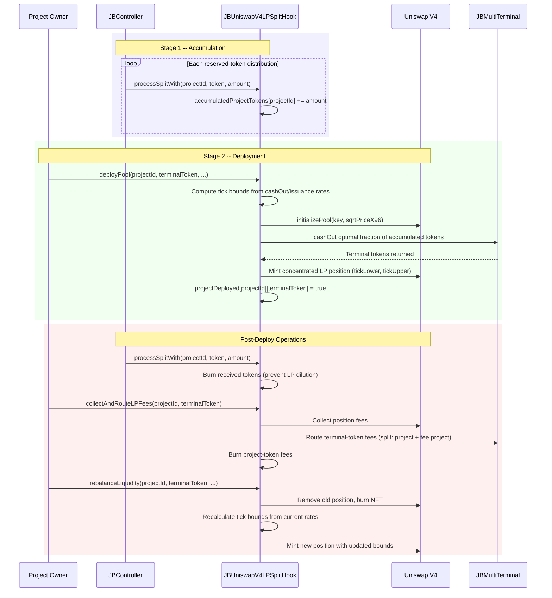

# Juicebox UniV4 LP Split Hook

Juicebox split hook that accumulates reserved project tokens over time, then deploys a single Uniswap V4 concentrated liquidity position for that project, bounded by the project's issuance rate (ceiling) and cash-out rate (floor). After deployment, it manages fee collection, liquidity rebalancing, and routes LP fees back to the project with a configurable fee split.

[Docs](https://docs.juicebox.money) | [Discord](https://discord.gg/juicebox)

## Conceptual Overview

This hook connects Juicebox's reserved token system to Uniswap V4's concentrated liquidity. It operates in two stages:

**Stage 1 -- Accumulation:** Configure the hook as a reserved-token split in a project's ruleset. Each time reserved tokens are distributed, the hook accumulates them. This continues across multiple ruleset cycles until enough tokens are collected.

**Stage 2 -- Deployment & Operation:** The project owner calls `deployPool()` to create a V4 pool and mint an LP position. This permanently selects the project's terminal-token path for this hook instance. The hook cashes out a geometrically-optimized fraction of the accumulated tokens (typically 15-30%) for terminal tokens, then provides both as concentrated liquidity bounded by the project's economic rates. After deployment, any newly received reserved tokens are burned to prevent LP dilution.

The LP position is bounded by two rate-derived ticks:
- **Lower bound (floor):** The cash-out rate -- what you get from redeeming project tokens via the bonding curve
- **Upper bound (ceiling):** The issuance rate -- what you get from paying into the project

This ensures the AMM price always trades within the project's intrinsic economic range.

### Lifecycle

```
1. Configure as reserved-token split in a Juicebox ruleset
   |
2. Controller distributes reserved tokens → processSplitWith()
   → Tokens accumulate in accumulatedProjectTokens[projectId]
   |
3. Project owner (or anyone after 10x weight decay) calls deployPool(...)
   → Creates V4 pool (with ORACLE_HOOK for TWAP) at geometric mean of [cashOut, issuance] rates
   → Cashes out optimal fraction of tokens for terminal tokens
   → Mints concentrated LP position bounded by rate-derived ticks
   → Sets projectDeployed[projectId][terminalToken] = true
   |
4. Future reserved token distributions → burn received tokens
   |
5. Anyone calls collectAndRouteLPFees(projectId, terminalToken)
   → Collects V4 position fees
   → Routes terminal token fees: FEE_PERCENT to fee project, rest to original project
   → Burns collected project token fees
   |
6. Project owner calls rebalanceLiquidity(projectId, terminalToken, ...)
   → Collects accrued fees and routes them
   → Removes old position, burns NFT
   → Recalculates tick bounds from current rates
   → Mints new position with updated bounds
   |
7. Authorized operator calls claimFeeTokensFor(projectId, beneficiary)
   → Transfers accumulated fee-project tokens to beneficiary
```

### Lifecycle Diagram



### Pool Pricing

The initial pool price is set at the **geometric mean** of the cash-out and issuance rate ticks. This centers the LP position in the economic range, creating balanced exposure to both sides. If the cash-out rate is zero (no surplus), the pool initializes at the issuance rate. When the pool is already initialized (e.g., by REVDeployer at 1:1 price), the hook reads the actual pool price via `getSlot0` instead of computing a new initial price. All pools are created with `ORACLE_HOOK` (an `IHooks` oracle hook set in the constructor) which provides TWAP pricing via `observe()`.

The geometric mean is computed in Uniswap V4's tick space: the midpoint of the cash-out and issuance ticks. Since ticks are logarithmic, the tick midpoint corresponds to the geometric mean of the two prices.

**Example:** If the cash-out rate is 0.5 ETH/token and the issuance rate is 2.0 ETH/token, the initial pool price is `sqrt(0.5 * 2.0) = 1.0 ETH/token`. The LP position's tick range spans from the 0.5 ETH/token tick (lower bound) to the 2.0 ETH/token tick (upper bound), with liquidity concentrated in this range.

### Optimal Cash-Out Calculation

V4 concentrated liquidity positions aren't 50/50 -- the token ratio depends on where the current price sits within the tick range. `_computeOptimalCashOutAmount` solves for the exact fraction of project tokens to cash out so the resulting token pair matches the LP geometry. The result is typically 15-30%, safety-capped at 50%.

## Architecture

| Contract | Description |
|----------|-------------|
| `JBUniswapV4LPSplitHook` | `IJBSplitHook` implementation with a two-stage lifecycle. Accumulates project tokens before deployment, burns them after. Creates V4 pools (with `ORACLE_HOOK` for TWAP), mints/rebalances LP positions, collects and routes fees. Constructor takes 7 params: `directory`, `permissions`, `tokens`, `poolManager`, `positionManager`, `permit2`, `oracleHook`. Inherits `JBPermissioned`. Each clone is initialized with `feeProjectId` and `feePercent`. |
| `JBUniswapV4LPSplitHookDeployer` | Factory that deploys hook clones via `LibClone`. Supports deterministic CREATE2 deployment with caller-scoped salts. Registers each deployment in `JBAddressRegistry`. Anyone can deploy a new hook by providing `feeProjectId` and `feePercent`. |

### Interfaces

| Interface | Description |
|-----------|-------------|
| `IJBUniswapV4LPSplitHook` | Public interface: `initialize`, `isPoolDeployed`, `poolKeyOf`, `deployPool`, `collectAndRouteLPFees`, `claimFeeTokensFor`. Events: `ProjectDeployed`, `LPFeesRouted`, `FeeTokensClaimed`, `TokensBurned`. |
| `IJBUniswapV4LPSplitHookDeployer` | Factory interface: `HOOK`, `ADDRESS_REGISTRY`, `deployHookFor`. Event: `HookDeployed`. |

## Supported Chains

Configured in `script/Deploy.s.sol` via Sphinx:

| Network | Chain ID | PositionManager |
|---------|----------|-----------------|
| Ethereum Mainnet | 1 | `0xbD216513d74C8cf14cf4747E6AaA6420FF64ee9e` |
| Optimism Mainnet | 10 | `0xbD216513d74C8cf14cf4747E6AaA6420FF64ee9e` |
| Base Mainnet | 8453 | `0xbD216513d74C8cf14cf4747E6AaA6420FF64ee9e` |
| Arbitrum Mainnet | 42161 | `0xbD216513d74C8cf14cf4747E6AaA6420FF64ee9e` |
| Ethereum Sepolia | 11155111 | `0xbD216513d74C8cf14cf4747E6AaA6420FF64ee9e` |
| Optimism Sepolia | 11155420 | `0xbD216513d74C8cf14cf4747E6AaA6420FF64ee9e` |
| Base Sepolia | 84532 | `0xbD216513d74C8cf14cf4747E6AaA6420FF64ee9e` |
| Arbitrum Sepolia | 421614 | `0xbD216513d74C8cf14cf4747E6AaA6420FF64ee9e` |

The Uniswap V4 PoolManager (`0x000000000004444c5dc75cB358380D2e3dE08A90`) and Permit2 (`0x000000000022D473030F116dDEE9F6B43aC78BA3`) addresses are the same on all chains.

## Install

```bash
npm install @bananapus/univ4-lp-split-hook-v6
```

If using Forge directly:

```bash
forge install
```

## Develop

| Command | Description |
|---------|-------------|
| `forge build` | Compile (requires `via_ir = true` due to stack depth) |
| `forge test` | Run all tests (14 test files + fork tests covering full lifecycle) |
| `forge test -vvv` | Run tests with full trace |

### Settings

```toml
# foundry.toml
[profile.default]
solc = '0.8.26'
evm_version = 'cancun'
optimizer_runs = 200
via_ir = true

[fuzz]
runs = 4096
```

## Repository Layout

```
src/
  JBUniswapV4LPSplitHook.sol               # Main split hook (~1300 lines)
  JBUniswapV4LPSplitHookDeployer.sol       # Clone factory (86 lines)
  interfaces/
    IJBUniswapV4LPSplitHook.sol            # Hook interface + events
    IJBUniswapV4LPSplitHookDeployer.sol    # Factory interface
test/
  ConstructorTest.t.sol                      # Constructor validation
  AccumulationStageTest.t.sol                # Stage 1: token accumulation
  DeploymentStageTest.t.sol                  # Pool creation, LP minting
  DeployerTest.t.sol                         # Clone factory + address registry
  FeeRoutingTest.t.sol                       # Fee collection and routing
  RebalanceTest.t.sol                        # Liquidity rebalancing
  NativeETHTest.t.sol                        # Native ETH handling
  PriceMathTest.t.sol                        # Price conversion math
  SecurityTest.t.sol                         # Permission checks, access control
  WeightDecayDeployTest.t.sol               # Permissionless deploy after 10x weight decay
  PositionManagerIntegrationTest.t.sol      # PositionManager interaction tests
  SplitHookRegressions.t.sol                # Audit finding regressions (H-2, M-1, M-2)
  IntegrationLifecycle.t.sol                 # Full end-to-end workflow
  Fork.t.sol                                 # Fork tests with real V4 + JB core
  fork/GeomeanLPFork.t.sol                  # Geometric mean pricing fork tests
  fork/TickBoundsAndFeeFork.t.sol           # Tick bounds and fee fork tests
  invariant/LPSplitHookInvariant.t.sol      # Invariant/fuzz tests
  TestBaseV4.sol                             # Shared test infrastructure
  regression/
    FeeProjectIdValidation.t.sol            # Fee project ID validation
    ReinitAfterRenounce.t.sol               # Re-init after renounce
    StaleTokenIdOf.t.sol                    # Stale tokenIdOf regression
    TickBoundsInversion.t.sol               # Tick bounds inversion
script/
  Deploy.s.sol                               # Sphinx deployment script
```

## Permissions

| Permission | Required For |
|------------|-------------|
| `SET_BUYBACK_POOL` | `deployPool` -- create V4 pool and mint LP position (unless weight has decayed 10x) |
| `SET_BUYBACK_POOL` | `rebalanceLiquidity` -- burn old position, mint new one with updated tick bounds |
| `SET_BUYBACK_POOL` | `claimFeeTokensFor` -- claim accumulated fee-project tokens |

`collectAndRouteLPFees` is **permissionless** -- anyone can call it. This is safe because it only collects fees from the existing position and routes them to verified project terminals.

`deployPool` becomes **permissionless** when the current ruleset's weight has decayed to 1/10th or less of the weight when the hook first started accumulating tokens. This prevents a stale owner from blocking LP deployment indefinitely.

## Risks

- **Impermanent loss:** The LP position is subject to standard concentrated liquidity IL. If the market price moves outside the [cashOut, issuance] range, the position becomes single-sided.
- **Stale tick bounds:** If the project's issuance or cash-out rates change significantly (e.g., new ruleset with different weight), the LP position bounds become stale. The project owner must call `rebalanceLiquidity` to update them.
- **Cash-out price impact:** The initial `deployPool` cashes out a fraction of accumulated tokens, which affects the bonding curve. Large accumulations may create meaningful price impact.
- **One terminal token per project:** `processSplitWith` does not receive the terminal token, so once any pool is deployed the hook permanently switches the project into burn mode. A second terminal-token pool is intentionally unsupported and `deployPool()` reverts.
- **One position per pool:** The hook manages a single V4 NFT position per project/terminal-token pair. Rebalancing destroys and recreates it, temporarily leaving no active position.
- **Fee-project token accumulation:** Fee-project tokens are held by the hook until claimed via `claimFeeTokensFor`. If the fee project token changes or is not deployed, tokens may be stuck.
- **Rebalance to zero liquidity:** If both token balances are zero when rebalancing, the transaction reverts with `InsufficientLiquidity` to prevent bricking the position (tokenIdOf would become zero while projectDeployed remains true).
